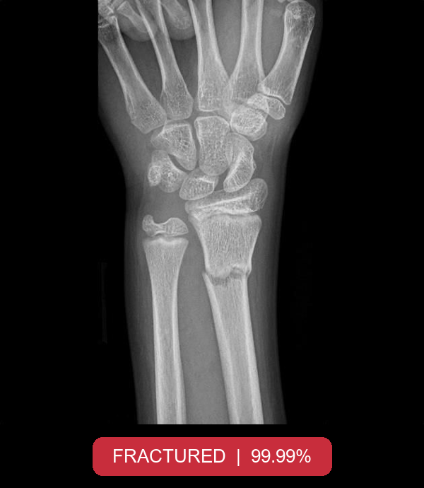

# Bone Fracture Classification System

A Streamlit-based clinical decision-support tool that classifies X-ray images as fractured or not fractured, built with EfficientNetB1 and SQLite-backed patient history logging.



## Overview

This is a decision-support tool, not a diagnostic replacement. A doctor enters basic patient details, uploads an X-ray image, and the system classifies it as fractured or not fractured with a confidence score. Every prediction, along with the patient's details, is logged to a local SQLite database and shown in a running history panel in the sidebar.

| Class | Label |
|-------|-------|
| 0 | Fractured |
| 1 | Not Fractured |

## Features

- EfficientNetB1 classifier, fine-tuned for binary fracture classification on 240×240 X-ray images
- Simple patient intake form — first name, last name, age, and date — alongside the image upload
- Confidence score shown alongside every prediction
- Every prediction logged to SQLite with the patient's details, confidence, and result
- Running session history displayed in the sidebar as a table
- Built-in disclaimer reminding users the system assists screening and does not replace professional diagnosis

## Model Evaluation

Trained on the [Fracture Multi-Region X-ray Dataset](https://www.kaggle.com/datasets/bmadushanirodrigo/fracture-multi-region-x-ray-data). Architecture: EfficientNetB1, 240×240 input.

Evaluated on a test set of 500 images:

| Class | Precision | Recall | F1-score | Support |
|-------|-----------|--------|----------|---------|
| Fractured | 1.00 | 0.97 | 0.99 | 238 |
| Not Fractured | 0.97 | 1.00 | 0.99 | 262 |
| **Accuracy** | | | **0.99** | 500 |
| Macro avg | 0.99 | 0.99 | 0.99 | 500 |
| Weighted avg | 0.99 | 0.99 | 0.99 | 500 |

Performance is strong despite a relatively small training set. Generalization could likely be improved further by training on more data from a wider range of sources.

## Project Philosophy

The core idea behind this project is to help doctors in their decision-making process — not to replace the doctor. The system is kept simple and straightforward, and is designed specifically for clinicians, not programmers.

**Why Grad-CAM was considered and left out.** Adding Grad-CAM to visualize what the model focuses on was considered, but it introduces a real risk in a tool aimed at doctors rather than programmers: a clinician could interpret the heatmap as pinpointing the exact location of the fracture, which could lead to a mistaken decision or a delay in diagnosis. For a programmer-facing tool, that visualization would be a reasonable debugging aid — for a clinician-facing one, it risks being misread as a diagnostic claim the model isn't actually making.

**How the model could be extended.** The model could be extended by training an entirely new, dedicated model for specific fracture types — for example, six distinct fracture categories instead of a binary fractured/not-fractured split. This would meaningfully raise both performance and clinical usefulness.

**What this system is, and isn't.** This system is designed primarily to assist — it is not a substitute for a doctor's judgment.

## Getting Started

### Install

```bash
git clone https://github.com/i0nlyaziz/Bone-Fracture-Classification-System.git
cd Bone-Fracture-Classification-System
pip install -r requirements.txt
```

### Run

```bash
streamlit run main.py
```

This opens the app in your browser. Fill in the patient details, upload an X-ray image, and click **Predict**.

## Project Structure

```
Bone-Fracture-Classification-System/
├── README.md
├── LICENSE
├── requirements.txt
├── .gitignore
├── main.py                 # Streamlit app: UI, prediction, and history display
├── database/
│   └── database.py          # SQLite table creation, insert, and read functions
├── model/
│   ├── bone_break_classifier.keras   # trained weights (portable — see below)
│   └── README.md
└── results/
    └── demo.png              # sample app screenshot
```

## How It Works

1. On startup, `create()` ensures the SQLite table exists and the trained model is loaded once and cached with `@st.cache_resource`.
2. The doctor fills in the patient's first name, last name, age, and date, then uploads an X-ray image.
3. On clicking **Predict**, the image is resized to 240×240, converted to an array, and passed to the model.
4. The predicted class (Fractured / Not Fractured) and its confidence score are shown directly in the UI.
5. The prediction, along with the patient's details, confidence, and result, is inserted into `DataBase.db` via `fill()`.
6. The sidebar calls `display()` to pull the full session history from the database and renders it as a table.

## Database

`database/DataBase.db`, table `user`:

| Column | Type | Description |
|--------|------|--------------|
| Id | INTEGER PRIMARY KEY AUTOINCREMENT | Record ID |
| first_name | TEXT | Patient's first name |
| second_name | TEXT | Patient's last name |
| age | INTEGER | Patient's age |
| date | TEXT | Date entered in the form |
| confidence_score | REAL | Model confidence, as a percentage string |
| prediction | TEXT | "fractured" or "not fractured" |

## Tech Stack

TensorFlow/Keras, EfficientNetB1, Streamlit, Pandas, Pillow, SQLite

## Limitations

- This is a decision-support tool only — it is not intended to provide a definitive diagnosis or replace professional medical judgment
- Trained on a relatively small dataset; performance on X-rays from different equipment, populations, or imaging protocols than the training data isn't guaranteed
- Binary classification only (fractured / not fractured) — it doesn't identify fracture type or location
- No visual explanation (e.g. Grad-CAM) is provided, by design — see Project Philosophy for why
- Patient data in `DataBase.db` is stored locally, unencrypted, and isn't part of the repo

## License

MIT — see [LICENSE](LICENSE) for details.